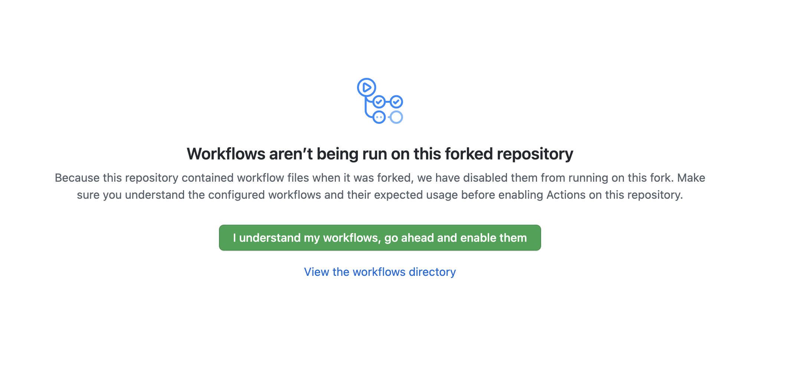

# Webapp og infrastruktur med React, Terraform og Open Source moduler

I denne oppgaven vil du lage en nettside ved hjelp av Amazon S3. S3 Buvket skal lages med Terraformkode, og statiske websider skal 
lages fra kildekode med NPM av Github actions og lastes opp. Appen er en enkel "hello world" skrevet i React. 

Vi skal se nærmer på; 

* Mer avansert Github actions. For eksempel; Flere jobber og avhengigheter mellom jobber
* Mer avansert Github actions - Bruke funksjonen ```github.issues.createComment``` for å legge på kommentarer på Pull requests 
* Terraform i Pipeline - GitHub actions skal kjøre Terraform. 
* Vi skal se hvordan vi kan bruke GitHub Actions til å bygge & publisere en enkel React.js webapp
* AWS - Hvordan bruke en open source modul til å spare masse tid, og publisere en enkel React.js webapp

## Lag en fork

Du må start emd å lage en fork av dette repositoryet til din egen GitHub konto.


## Logg i Cloud 9 miljøet ditt


* Logg på med din AWS bruker med URL, brukernavn og passord gitt i klassrommet
* Gå til tjenesten Cloud9 (Du nå søke på Cloud9 uten mellomrom i søket)
* Velg "Open IDE"
* Hvis du ikke ser ditt miljø, kan det hende du har valgt feil region. Hvilken region du skal bruke vil bli oppgitt i klasserommet.

### Lag et Access Token for GitHub

* Når du skal autentisere deg mot din GitHub konto fra Cloud 9 trenger du et access token.  Gå til  https://github.com/settings/tokens og lag et nytt.
* NB. Ta vare på tokenet et sted, du trenger dette senere når du skal gjøre ```git push```


Access token må ha "repo" tillatelser, og "workflow" tillatelser.


### Lage en klone av din Fork (av dette repoet) inn i ditt Cloud 9 miljø

Fra Terminal i Cloud 9. Klone repositoriet *ditt* med HTTPS URL. Eksempel ;

```
git clone https://github.com/≤github bruker>/02-CD-AWS-lamda-sls
```

Får du denne feilmeldingen ```bash: /02-CD-AWS-lamda-sls: Permission denied``` - så glemte du å bytte ut <github bruker> med
ditt eget Github brukernavn :-)


OBS Når du gjør ```git push``` senere og du skal autentisere deg, skal du bruke GitHub Access token når du blir bedt om passord,
så du trenger å ta vare på dette et sted.

For å slippe å autentisere seg hele tiden kan man få git til å cache nøkler i et valgfritt
antall sekunder på denne måten;

```shell
git config --global credential.helper "cache --timeout=86400"
```

Konfigurer også brukernavnet og e-posten din for GitHub CLI. Da slipepr du advarsler i terminalen
når du gjør commit senere.

````shell
git config --global user.name <github brukernavn>
git config --global user.email <email for github bruker>

````

## Slå på GitHub actions for din fork 

I din fork av dette repositoriet, velg "actions" for å slå på støtte for GitHub actions i din fork.



## Test Demo applikasjonen fra Cloud9 

Gå til demo-app katalogen 

```python
cd demo-app
npm run start 
```

## Oppgave 1 - tilpass  terraformkode

* En Terraform "backend" en lagringsplass for Terraform metadata som beskriver hvordan infrakode og den faktiske infrastrukturen henger sammen. Man kan si at Terraform state holder orden på rlasjon mellom faktisk infrastruktur 
og infra-kode 
* Siden hver enkelt student har sin egen infrastruktur og egen pipeline, må dere også ha deres egne, separate state fil. 
I provider.tf har vi en Backend for Terraform sin state basert på S3. Du må her erstatte ````<studentnavn>```` med ditt eget brukernavn
* Følgende konfigurasjon forteller terraform at Backend er på Amazon AWS S3, i hvilken bucket, og hvilken statefil som skal brukes.
```hcl
  backend "s3" {
    bucket = "pgr301-2021-terraform-state"
    key    = "<studentnavn>/terraform-in-pipeline.state"
    region = "eu-west-1"
  }
```

Må må nå fjerne hardkodingen av "glenn" i static_website.tf filen. Det er ikke god praksis å hardkode
verdier ("glenn...") på denne måten. - 

Lag en variables.tf i rotkatalogen. Velg dit eget bucketnavn for ```<the bucket name>```. Dette må være globalt unikt.

```hcl
variable "bucket_name" {
  description = "The name of the bucket to create"
  default = "<the bucket name>"
}
```
For mer informasjon om varialer se her; https://www.terraform.io/docs/language/values/variables.html

Da kan vi Istedet for å skrive
```hcl

resource "aws_s3_bucket" "frontend" {
  bucket =  "glenn-demobucket"
  acl = "public-read"
```

Da kan vi også bruke følgende syntaks

```hcl
resource "aws_s3_bucket" "frontend" {
  bucket = var.bucket_name
  acl = "public-read"
```
Og istedet for

```hcl     
     "Effect": "Allow",
      "Resource": "arn:aws:s3:::glenn/*",
      "Principal": "*"
    }
```
.. Så kan vi da skrive 

```hcl
   "Effect": "Allow",
   "Resource": "arn:aws:s3:::${var.bucket_name}/*",
   "Principal": "*"
```

## Test koden fra Cloud 9

Du er nå klar for å teste infrastrukturkoden fra Cloud9 miøjøet ditt 
```sh
terraform plan
terraform apply
```

## Oppgave 2 - endre pipelinekode

* Modifiser filen ```.github/workflows/pipeline.yaml``` og tilpass denne ditt eget miljø.
* Du må endre på denne delen av filen,

```yaml
- run: aws s3 cp build s3://<bucket_navn>> --recursive --region eu-west-1
  working-directory: ./demo-app 
```


* Du skal erstatte bucket navnet ```<bucket_name>``` med ditt eget bucketnavn som du valgte i variables.tf

### En glennomgang av Pipeline.yaml

Vi sette hemmeligheter på denne måten slik at terraform har tilgang til AWS nøkler, og har de rettighetene som er nødvendig. 

```yaml
    env:
      AWS_ACCESS_KEY_ID: ${{ secrets.AWS_ACCESS_KEY_ID }}
      AWS_SECRET_ACCESS_KEY: ${{ secrets.AWS_SECRET_ACCESS_KEY }}
      AWS_REGION: eu-west-1
```

Her ser vi et steg i en pipeline med en ```if``` - som bare skjer dersom det er en ```pull request``` som bygges, vi ser også at 
pipeline får lov til å fortsette dersom dette steget feiler.
```
      - name: Terraform Plan
        id: plan
        if: github.event_name == 'pull_request'
        run: terraform plan -no-color
        continue-on-error: true
```

* Her setter vi en variabel lik _all output fra et tidligere steg (!)_  

```yaml
       env:
          PLAN: "terraform\n${{ steps.plan.outputs.stdout }}"
```

Her bruker vi også den innebyggede funksjonen  ```github.issues.createComment``` til å lage en kommentar til en Pull request, med innholdet av Terraform plan. Altså, hva kommer til å skje hvis vi kjører en apply på denne.

```yaml
  script: |
    const output = `#### Terraform Format and Style 🖌\`${{ steps.fmt.outcome }}\`
    #### Terraform Initialization ⚙️\`${{ steps.init.outcome }}\`
    #### Terraform Validation 🤖\`${{ steps.validate.outcome }}\`
    #### Terraform Plan 📖\`${{ steps.plan.outcome }}\`
    <details><summary>Show Plan</summary>
    \n
    \`\`\`\n
    ${process.env.PLAN}
    \`\`\`
    </details>
    *Pusher: @${{ github.actor }}, Action: \`${{ github.event_name }}\`*`;
    
    github.issues.createComment({
      issue_number: context.issue.number,
      owner: context.repo.owner,
      repo: context.repo.repo,
      body: output
    })
```

Når noen gjør en Git push til main branch, kjører vi ```terraform apply``` med ett flag ```--auto-approve``` som gjør at terraform ikke 
spør om lov før den kjører.

```yaml
      - name: Terraform Apply
        if: github.ref == 'refs/heads/main' && github.event_name == 'push'
        run: terraform apply -auto-approve
```

Student webapp trenger infrastrukturen laget av terraform. Vi kan da bruke ```needs``` for å lage en avhengighet mellom en eller flere jobber; 

```yaml
student_webapp:
    env:
      AWS_ACCESS_KEY_ID: ${{ secrets.AWS_ACCESS_KEY_ID }}
      AWS_SECRET_ACCESS_KEY: ${{ secrets.AWS_SECRET_ACCESS_KEY }}
      AWS_REGION: eu-west-1
    needs: terraform
```

Å publisere en statisk website, og hoste denne på AWS S3 gjøres nå i to steg; 

* npm build, som bygger et sett med statiske websider av applikasjonen 
* kopiering av disse filene til en S3 bucket 

For en grundig gjennomgang av hva som skjer i kulissene her; sjekk gjerne ut denne; https://medium.com/@p_stotz/static-website-hosting-leverage-aws-s3-with-cloudfront-route53-acm-and-lambda-edge-8c781bc3b390
Fordelen med Terraformmoduler er at vi kan komme raskt i gang uten nødvemdigvis å kunne alle detaljene. 

# Test løsningen i nettleser

* Gratulerer! Du har nå publisert din egent React.js web app på AWS. I nettleser kan du nå skrive http://<bucket_name> 
* Prøv å endre på Javascript filene, følg med på pipeline i "actions" i GitHub, og se at endringene kommer ut. 

# Ekstra 

Følg tutorial for hvordan dere kan lage egne terraform moduler; https://learn.hashicorp.com/tutorials/terraform/module-create
